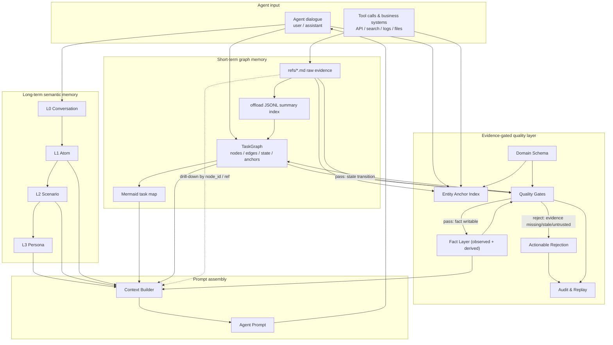
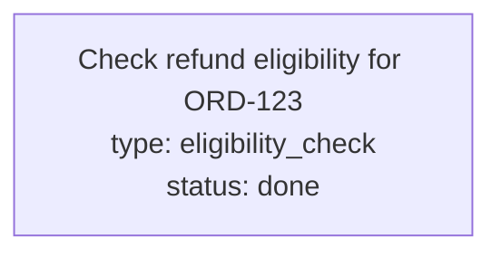

<p align="center">
  
</p>

<p align="center">
  <a href="https://pypi.org/project/evidence-gated-memory/"></a>
  <a href="https://pypi.org/project/evidence-gated-memory/"></a>
  <a href="#license"></a>
  <a href="#benchmarks"></a>
  <a href="#benchmarks"></a>
</p>

<p align="center">
  <b>Provenance-first graph memory for hard-anchor enterprise agents.</b><br>
  <sub>Every fact must pass a gate. Every state transition must pass a gate. Every conclusion drills down to raw evidence.</sub>
</p>

<p align="center">
  <a href="#quick-start">Quick start</a> ·
  <a href="#why-egm">Why EGM</a> ·
  <a href="#architecture">Architecture</a> ·
  <a href="#benchmarks">Benchmarks</a> ·
  <a href="#how-it-compares">Comparison</a> ·
  <a href="docs/architecture.md">Architecture doc</a>
</p>

---

## TL;DR

```
┌─────────────────────────┐   ┌─────────────────────────┐   ┌─────────────────────────┐
│  Short-term task graph  │   │   Evidence-gated facts  │   │  Long-term L0→L3 memory │
│                         │   │                         │   │                         │
│  TaskNode + TaskEdge    │   │  No evidence → no fact  │   │  Conversation → Atom    │
│  Mermaid projection     │   │  Stale → block/warn     │   │     → Scenario → Persona│
│  refs/ raw drill-down   │   │  Rejection is actionable│   │  Manual, auditable      │
└─────────────────────────┘   └─────────────────────────┘   └─────────────────────────┘
                  ▲                       ▲                       ▲
                  └───────────────────────┼───────────────────────┘
                                          │
                         build_context() — one compact, drillable prompt
```

**The goal is not to remember more text. The goal is to keep a compact task map while preserving a path back to the original evidence.**

---

## Quick start

```bash
pip install evidence-gated-memory
```

```python
from evidence_gated_memory import EvidenceGatedMemory, TaskNodeStatus
from evidence_gated_memory.schemas.builtin import REFUND

memory = EvidenceGatedMemory(workspace=".egm", domain_schema=REFUND)

# 1. Record raw evidence — content is written to refs/<id>.md, indexed in SQLite.
order = memory.record_evidence(
    evidence_type="order_record",
    source="order_api", source_system="order_api",
    content='{"order_id":"ORD-123","status":"PAID"}',
)
policy = memory.record_evidence(
    evidence_type="refund_policy",
    source="policy_db", source_system="policy_db",
    content="Full refund within 14 days of purchase.",
)

# 2. Assert a fact — it goes through the gate before it can be written.
result = memory.assert_fact(
    "ORD-123 is eligible for refund under the 14-day policy",
    claim_type="refund_eligibility",
    evidence=[order, policy],
)

if not result.accepted:
    print(result.gate.rejection_reason)   # what's missing
    print(result.gate.suggested_action)   # what to do next
else:
    print(result.fact.id)                 # gated fact, ready for prompt context

memory.close()
```

That's the loop. **No evidence, no fact.** Stale or untrusted evidence is rejected with an actionable message, not silently accepted.

---

## Why EGM

A long-running agent produces a linear, ever-growing history. Three things go wrong with it:

- **Plain summaries lose evidence.** Once a tool result is summarized, you can't drill back to the API response that justified the conclusion.
- **Plain memory lacks process structure.** Vector recall finds related text, but it can't tell you which task node is blocked, or why.
- **Enterprise agents need discipline, not just recall.** In refund, finance, compliance, medical, and coding agents, the cost of a wrong "done" is far higher than the cost of being slow.

EGM is built for **hard-anchor** workflows — those organized around stable business IDs like `order_id`, `ticket_id`, `refund_id`, `task_id` — not open-ended persona-style dialogue. This is a deliberate trade: EGM gives up open relationship-heavy recall to gain **provenance, freshness, and state discipline** on enterprise processes.

---

## How it compares

|  | Mem0 / Zep / Letta | **EGM** |
|---|---|---|
| Default write policy | write-optimistic | **write-pessimistic at fact layer** |
| Evidence requirement | optional | **mandatory, per-claim-type** |
| Task structure | flat / graph-of-facts | **hard-anchor task graph + soft state machine** |
| Ref-level freshness | no | **fresh / stale / expired per evidence type** |
| Cascading invalidation | no | **derived facts track observed parents** |
| State-transition gating | no | **DONE / blocked / etc. all gated** |
| Rejection behavior | boolean | **actionable: what's missing + what to call** |
| Drill-down to raw evidence | usually lost | **`refs/<id>.md` preserved, indexed by `node_id`** |
| Best-fit domain | open dialogue, personas | **hard-anchor enterprise workflows** |

---

## Architecture

EGM has three pillars. They are independent layers that compose into one prompt at `build_context()` time.

### 1. Short-term graph memory — foldable context for the current task

```
tool result  →  refs/*.md (raw)  →  offload JSONL (summary index)  →  TaskGraph  →  Mermaid projection
```

- `refs/*.md` is the **raw evidence layer**. Full tool calls, API responses, logs, file fragments — never summarized away.
- `offload JSONL` is the **mid-level index**. Each record carries `node_id`, `result_ref`, `tool_call_id`, `summary`, `score`.
- `TaskGraph` is a **structured object** (`Task` / `TaskNode` / `TaskEdge`), not just Mermaid text. Mermaid is one readable projection.
- The agent reads the high-level map and drills down by `node_id` / `result_ref` only when needed.

### 2. Long-term semantic memory — cross-session background

```
L0 Conversation  →  L1 Atom  →  L2 Scenario  →  L3 Persona
```

A manually-promoted, auditable pyramid. Every L1 atom can point back to L0 source messages; every L2 scenario is grounded in real L1 ids; every L3 persona is grounded in real L2 ids. `build_context()` injects L1–L3 summaries with source ids; L0 raw messages stay out of the prompt by default. **Automatic LLM distillation is intentionally deferred** until it has its own design.

### 3. Evidence-gated quality layer — what makes the graph trustworthy

This is EGM's key differentiator. **No conclusion becomes a fact without evidence:**

```
No payment_record           → cannot say the order is refundable.
No refund_api_response      → cannot say the refund is completed.
Expired refund_api_response → cannot keep using stale evidence.
source_system not allowlisted → cannot support a high-stakes fact.
A derived fact whose observed parent expired → must also expire.
```

Components:

- **Domain Schema** (YAML) — entities, evidence types, trusted sources, TTLs, required evidence per claim, gates per state transition. **Business rules are configured, not hardcoded.**
- **Entity Anchor Index** — resolves hard anchors via `metadata → connector → regex → LLM fallback`. LLM-extracted entities are stored as **low-trust annotations only**; never an acceptable source for fact grounding.
- **Quality Gates** — enforce required evidence, source allowlists, freshness, and state-transition rules.
- **Actionable Rejection** — never just `False`. Returns what's missing, why, which tool to call next, and the `audit_id`.
- **Audit & Replay** — full evidence chain, rejection records, state changes. History recoverable after a context wipe.

<details>
<summary>Click to expand the full data-flow diagram</summary>



</details>

Full architecture document: [docs/architecture.md](docs/architecture.md).

---

## What context looks like

`build_context()` returns a single, compact, provenance-labeled prompt. Pass `task_id` for the Mermaid task map; pass `query` to narrow fact and long-term recall.

````
# Evidence-Gated Memory Context
_query: ORD-123_
_task_id: refund:ORD-123_

<long_term_memory>
[PERSONA] Refund-agent operator (id: persona_123)
[SCENARIO] Refund completion rules (id: scene_123)
[ATOM:instruction] Refund completion requires refund_api_response evidence. (id: atom_123)
</long_term_memory>

<task_map>

</task_map>

<task_status>open</task_status>
<current_state>done</current_state>

[FACT] Order ORD-123 is eligible for refund under the 14-day policy
  claim_type: refund_eligibility  kind: observed
  - ref=ref_123 type=order_record   source=order_api  observed=0.0h ago [fresh]
  - ref=ref_456 type=refund_policy  source=policy_db  observed=0.0h ago [fresh]
````

The agent reads the high-level map; when it needs to verify, it drills down by `node_id`, `ref`, `atom_id`, `scenario_id`, or `persona_id`. Gate rejections are returned by `assert_fact()` / `transition_node()` and recorded in the audit log — `build_context()` is the prompt snapshot, not the rejection API.

---

## Refund demo — full evidence-gated loop

`examples/refund_agent/run.py` runs the deterministic loop end-to-end:

```
User requests refund for ORD-123
        ▼
assert refund_eligibility       → gate: no evidence_refs
        ▼
[REJECTED] missing order_record + refund_policy
        ▼
fetch tools → order_record + refund_policy → refs/*.md
        ▼
re-assert refund_eligibility    → ✅ written to Fact Layer
        ▼
assert refund_completed         → gate: missing fresh refund_api_response
        ▼
[REJECTED] actionable: call refund_api
        ▼
fetch refund_api_response → re-assert → ✅
        ▼
build_context() → gated facts + refs (with fresh/stale/expired labels)
        ▼
revoke_evidence(order_ref) → derived facts cascade-invalidate
```

```bash
python examples/refund_agent/run.py                              # deterministic, no API key
python examples/deepseek_refund_agent/run.py --mock              # LLM-shaped, mocked
DEEPSEEK_API_KEY=... python examples/deepseek_refund_agent/run.py  # real LLM proposes; EGM decides
```

---

## CLI

```bash
egm schema validate refund
egm inspect .egm --schema refund            # TaskGraph + long-term + offload + schema_version
egm context .egm --schema refund --query ORD-123
egm context .egm --schema refund --task-id refund:ORD-123
egm audit .egm --limit 20                   # who wrote what, who got rejected and why
egm sweep .egm --schema refund              # expire stale evidence, cascade-invalidate
egm ref .egm ref_abc123                     # drill down to raw evidence
```

---

## Benchmarks

> EGM's benchmark posture is honest by construction: we report what we run, we don't report what we haven't.

### Benchmark map

| Group | Suite | What it measures | Status |
|---|---|---|---|
| **τ-bench** (Anthropic, customer-service agents) | `tau-bench/retail`, `tau-bench/airline` | Tool-using agent on multi-turn business tasks. EGM plugs in as the agent's memory layer. | 🚧 in progress |
| **τ²-bench** (Anthropic follow-up) | `tau2-bench` | Harder multi-turn tasks with stricter evaluators. | 🚧 in progress |
| **Repo-local probes** | `benchmarks/run_local.py` | Deterministic, CI-friendly probes of EGM's product surface. | ✅ shipped |

### Repo-local probes (deterministic, CI-friendly)

These are not leaderboard submissions; they are probes that map well-known benchmark shapes onto EGM's hard-anchor, evidence-gated surface.

```bash
python benchmarks/run_local.py             # human-readable
python benchmarks/run_local.py --json      # machine-readable for CI
python -m pytest tests/test_benchmarks.py -q
```

| Probe | What it checks |
|---|---|
| `longmemeval_s_hard_anchor` | hard-anchor recall, evidence-source coverage, unsupported-query abstention |
| `locomo_style_semantic_pyramid` | manual L0/L1/L2/L3 recall with raw L0 exclusion |
| `beam_lite_hard_anchor_pressure` | bounded context + drill-down source coverage under synthetic pressure |
| `false_done_gate_benchmark` | false-completion claims **must** be rejected with actionable feedback until fresh evidence is attached |

See [benchmarks/README.md](benchmarks/README.md) and the latest report at [reports/benchmark_report.md](reports/benchmark_report.md).

### Optional official-data runners

For public-facing retrieval reports against official benchmark data:

```bash
python benchmarks/official/longmemeval_s.py path/to/longmemeval_s.json --top-k 5 --output reports/longmemeval_s_egm.json
python benchmarks/official/locomo.py        path/to/locomo.json        --top-k 5 --output reports/locomo_egm.json
```

These produce Recall@K / MRR over official evidence fields. They are **not** official leaderboard submissions unless paired with the benchmark's full generative-QA and judging protocol.

### Honest reading of the signal

EGM is strongest on **hard-anchor, strong-process, strong-evidence** enterprise workflows. It deliberately trades open-ended persona-style recall for provenance and process discipline. Historical signal from the predecessor `agent_memory_core`:

| Benchmark | Metric | Result |
|---|---|---|
| LongMemEval-S | Evidence Source Coverage | **0.87** |
| LongMemEval-S | False Fact Rate | **0.00** |
| BEAM-lite (100K tok / 50 cases) | recall under pressure | stable on hard-anchor cases |
| LoCoMo10 | answer-term recall | weak — known limitation on open-dialogue relationship recall |

τ-bench / τ²-bench numbers will land here when the integration is complete.

---

## What it is / is not

**It is.** A Python library (`pip install evidence-gated-memory`) that gives a hard-anchor enterprise agent a graph-structured, evidence-gated memory system. Domain rules are driven by YAML schemas, not hardcoded.

**It is not.** An agent framework, a vector database, or an open-ended chatbot memory. You orchestrate your agent however you like (LangGraph, a hand-written loop, anything else); EGM manages its memory, evidence, and task state.

---

## Core principle

```
Raw events are append-only.
Facts are evidence-gated.
Task-state transitions are evidence-gated.
Prompt context is provenance-filtered and drillable.
```

A rejected claim must be actionable. Evidence can expire; facts must follow.

---

## Citation

If you use EGM in research, please cite:

```bibtex
@software{egm2026,
  title  = {Evidence-Gated Memory: Provenance-First Graph Memory for Hard-Anchor Enterprise Agents},
  author = {yushui2022},
  year   = {2026},
  url    = {https://github.com/yushui2022/Evidence-Gated-Memory}
}
```

---

## License

MIT
