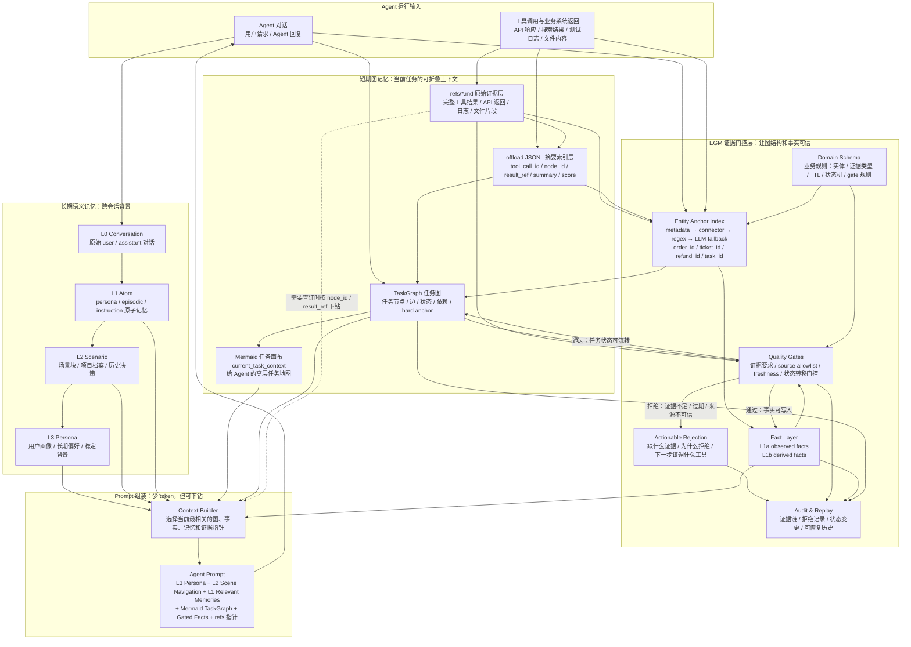
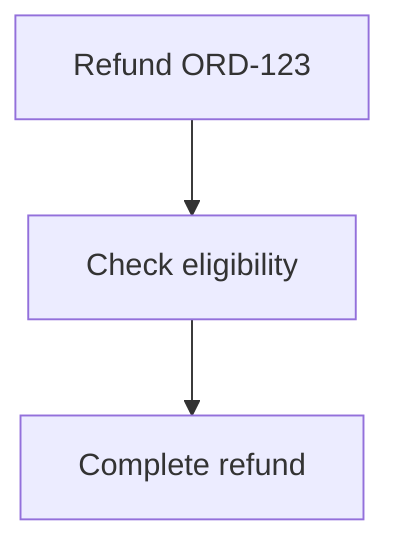

<p align="center">
  
</p>

# Evidence-Gated Memory (EGM)

> **Graph-structured, evidence-gated memory for hard-anchor enterprise agents.**
>
> EGM folds long task histories into Mermaid task graphs, preserves raw evidence in `refs/`, and gates both fact writes and task-state transitions with schema-defined evidence rules.

Evidence-Gated Graph Memory turns a linear agent history into a layered, recoverable task memory.

It combines three ideas:

1. **Symbolic short-term memory** — heavy tool outputs are offloaded into `refs/*.md`, indexed by `node_id` / `result_ref`, and folded into a Mermaid task graph.
2. **Layered long-term memory** — the current foundation records L0 raw messages, manually promoted L1 atoms, L2 scenarios, and L3 persona profiles.
3. **Evidence-gated quality control** — business facts and task-state transitions must pass schema-defined gates for required evidence, trusted sources, freshness, and auditability.

**The goal is not to remember more text. The goal is to keep a compact task map while preserving a path back to the original evidence.**

---

## Why EGM

A long agent run produces a linear, ever-growing history. Three things go wrong with it:

- **Plain summaries lose evidence.** Once a tool result is summarized, you can't drill back down to the API response that justified a conclusion.
- **Plain memory lacks process structure.** Vector recall finds related text, but it can't tell you which task node is blocked, or why.
- **Enterprise agents need discipline, not just recall.** In refund, finance, compliance, medical, and coding agents, the cost of a wrong "done" is far higher than the cost of being slow. A conclusion must be backed by fresh, trusted, traceable evidence — or it must not become a fact at all.

EGM is built for **hard-anchor** workflows — those organized around stable business IDs like `order_id`, `ticket_id`, `refund_id`, `task_id` — not open-ended relationship-heavy dialogue. This is a deliberate trade: EGM gives up open persona-style long-term recall to gain provenance, freshness, and state discipline on enterprise processes.

---

## Architecture

> **TencentDB Agent Memory solves "how context becomes foldable, drillable, recoverable."**
> **EGM adds "evidence gating, evidence freshness, state-transition quality gates, and a hard-anchor enterprise task graph" on top of it.**

EGM does not discard the graph structure of TencentDB Agent Memory. It layers an enterprise-grade quality discipline on top of its short-term Mermaid task graph / `refs` / L0–L3 long-term memory.

For the stabilized M1 architecture, see [docs/architecture.md](docs/architecture.md).



### The three layers

**1. Short-term graph memory — foldable context for the current task**

Tool results are never dumped wholesale into the prompt. Instead:

```
refs 原文  →  offload JSONL 摘要索引  →  Mermaid 任务图
```

- `refs/*.md` is the **raw evidence layer**, not a summary. It holds complete tool calls, API responses, test logs, and file fragments.
- `offload JSONL` is the **mid-level index**. Each record carries `node_id`, `result_ref`, `tool_call_id`, `summary`, `score`, `timestamp`. Here `score` means "how well the summary can replace the original" — not fact confidence.
- `TaskGraph` is the **core short-term memory**. It is a structured object, not just Mermaid text:

  ```
  task_id / node_id / node_type / status / anchors
  refs / facts / dependencies / blocked_reason / suggested_action
  ```

  Mermaid is one readable projection of the TaskGraph. The agent attends to the high-level map and drills down to lower layers via `node_id` / `result_ref` only when needed.

**2. Long-term semantic memory — cross-session background**

User dialogue should not become flat embedding search. The target design is a semantic pyramid:

```
L0 Conversation  →  L1 Atom  →  L2 Scenario  →  L3 Persona
```

This answers "who is the user, what is the project background, what were the historical decisions." The current implementation has the full manual L0/L1/L2/L3 foundation: raw conversation messages, manually promoted persona / episodic / instruction atoms, scenario blocks that group related atoms, and persona profiles grounded in scenarios. Automatic LLM distillation is intentionally left out until it has a separate design.

**3. Evidence-gated quality layer — what makes the graph and facts trustworthy**

This is EGM's key enhancement over plain graph memory. TencentDB Agent Memory emphasizes traceability; EGM adds the discipline that **no conclusion becomes a fact without evidence**:

```
No payment_record        → cannot say the order is refundable.
No refund_api_response   → cannot say the refund is completed.
Expired refund_api_response → cannot keep using stale evidence.
source_system not allowlisted → cannot support a high-stakes fact.
A derived fact whose observed parent has expired → must also expire.
```

- **Domain Schema** is the business rulebook (entities, evidence types, trusted sources, TTLs, required evidence per claim, gates per state transition). This is where gate rules come from — they are configured per domain in YAML, not hardcoded.
- **Entity Anchor Index** resolves hard anchors via a chain: `metadata → connector → regex → LLM fallback`. LLM-extracted entities carry a source span and confidence and are stored as **low-trust annotations only** — they are never an acceptable source for fact grounding.
- **Quality Gates** enforce required evidence, source allowlists, freshness, and state-transition rules.
- **Actionable Rejection** never just returns `False`. It returns: what evidence is missing, why it was rejected, which tool to call, which source to query, and the `audit_id` of the rejection.
- **Audit & Replay** keeps the full evidence chain, rejection records, and state changes — so history is recoverable after a context wipe.

---

## Quick start

```python
from evidence_gated_memory import EvidenceGatedMemory
from evidence_gated_memory.schemas.builtin import REFUND

memory = EvidenceGatedMemory(workspace=".egm", domain_schema=REFUND)

# 1. The user asks for a refund — recorded as an event and a task node.
memory.record_event(role="user", content="Process refund for ORD-123")

# 2. Tool results are written to refs/ and indexed into the task graph.
order_ref = memory.record_evidence(
    evidence_type="order_record",
    source_system="order_api",
    content=order_api_result,
    metadata={"order_id": "ORD-123"},
)

# 3. Asserting a fact must pass the gate.
result = memory.assert_fact(
    "Order ORD-123 is eligible for refund",
    claim_type="refund_eligibility",
    evidence=[order_ref],
)

if not result.accepted:
    print(result.rejection_reason)   # "missing required evidence types: ['payment_record']"
    print(result.suggested_action)   # "fetch payment_record for ORD-123 from payment_api"
```

---

## Refund demo — the full loop

`examples/refund_agent/run.py` walks the complete hard-anchor loop:

```
用户要求退款 ORD-123
        │  record_event → 任务图新建 refund 节点（anchor: order_id=ORD-123）
        ▼
工具返回订单数据 → 写入 refs/ → offload 索引 → 挂到任务节点
        ▼
assert refund_eligibility
        │  gate: 缺 payment_record
        ▼
[BLOCKED] eligibility 节点
   reason: missing payment_record
   suggested_action: call payment_api.get_payment(order_id="ORD-123")
        ▼
补 payment_record 证据 → 重新 assert → 通过 → 写入 Fact Layer，节点状态流转
        ▼
assert refund_completed
        │  gate: 缺 refund_api_response（state transition 门控）
        ▼
[BLOCKED] completed 节点
   reason: refund_completed requires fresh refund_api_response
        ▼
build_context()
        ▼
输出 = Mermaid 任务图 + gated facts + refs 指针（带 fresh/stale/expired 标注）
```

Run it without any API key:

```bash
python examples/refund_agent/run.py
```

An optional DeepSeek-backed variant drafts the claims with a real LLM (EGM still decides acceptance):

```bash
python examples/deepseek_refund_agent/run.py --mock          # no key needed
DEEPSEEK_API_KEY=... python examples/deepseek_refund_agent/run.py
```

---

## What context looks like

`build_context()` returns a compact, provenance-labeled prompt — a task map plus gated facts plus drill-down pointers:

```
<task_map>

</task_map>

<current_state>blocked</current_state>

[FACT] Order ORD-123 status is PAID
  source: order_api  observed: 2026-05-26T10:00  freshness: fresh
  node: N2  ref: refs/ref_0b51.md

[BLOCKED] Refund REF-456 is completed
  gate: state_transition_requires_evidence
  reason: refund_completed requires fresh refund_api_response
  action: call refund_api.get_refund(refund_id="REF-456")
  audit: audit_017
```

The agent reads the high-level map; when it needs to verify, it drills down by `node_id` / `result_ref` to the raw `refs`.

---

## CLI

```bash
egm schema validate refund
egm inspect .egm --schema refund
egm context .egm --schema refund --query ORD-123
egm graph .egm --schema refund            # render the current Mermaid task graph
egm audit .egm --limit 20
egm sweep .egm --schema refund            # expire stale evidence, cascade-invalidate
egm ref .egm ref_abc123                   # drill down to raw evidence
```

---

## What it is / is not

**It is:** a Python library (`pip install evidence-gated-memory`) that gives a hard-anchor enterprise agent a graph-structured, evidence-gated memory system. Domain rules are driven by YAML schemas, not hardcoded.

**It is not:** an agent framework, a vector database, or an open-ended chatbot memory. You orchestrate your agent with whatever you like (LangGraph, a hand-written loop); EGM manages its memory, evidence, and task state.

---

## Differentiators

| | Mem0 / Zep / Letta | **EGM** |
|---|---|---|
| Default policy | write-optimistic | **write-pessimistic at fact layer** |
| Evidence required | optional | **mandatory** |
| Task structure | flat / graph-of-facts | **hard-anchor task graph + soft state machine** |
| Ref-level freshness | no | **yes (TTL per evidence type)** |
| Cascading invalidation | no | **yes (derived facts track observed parents)** |
| State-transition gating | no | **yes (e.g. DONE requires verification)** |
| Gate rejection | boolean | **actionable (what's missing + what to do)** |
| Drill-down to raw evidence | usually lost | **yes (refs preserved, indexed by node_id)** |

---

## Benchmarks

Measured on the predecessor `agent_memory_core` over continuous long-horizon sessions:

| Benchmark | Signal | Result |
|---|---|---|
| LongMemEval-S | Evidence Source Coverage | **0.87** (matches keyword FTS, with source-backed evidence constraints) |
| LongMemEval-S | False Fact Rate | **0.00** |
| BEAM-lite (100K tokens / 50 cases) | recall under pressure | stable on synthetic hard-anchor cases |
| LoCoMo10 | answer-term recall | **weak** — known limitation on relationship-heavy open dialogue |

The honest reading: EGM is strongest on **hard-anchor, strong-process, strong-evidence** enterprise workflows. It deliberately trades open-ended persona-style recall for provenance and process discipline. Symbolic short-term memory is **not** suited to weak-anchor, high-entanglement conversational products.

---

## Core principle

```
Raw events are append-only.
Facts are evidence-gated.
Task-state transitions are evidence-gated.
Prompt context is provenance-filtered and drillable.
```

A rejected claim must be actionable. Evidence can expire; facts must follow.

---

## License

MIT

---

## Project status & handoff (updated 2026-05-26, late-night session)

This section is the single source of truth for "where the project is right now."
It is meant to be read cold — by a future-me, a collaborator, or a new Claude/Codex session — and be enough to resume work without losing context.

### Where we are

EGM has completed **Milestone M1: restoring the graph-memory pillar** on top of the v0.1 evidence-gating core.

- **v0.1 (shipped):** evidence + claims + facts + freshness + cascading invalidation + audit + CLI. Tests green (49/49).
- **M1 complete:** the flat fact store now has a hard-anchor **task graph** with structured TaskNodes, evidence-gated state transitions, and a Mermaid projection that the agent can read as a task map.
- **M2 foundation complete:** L0 Conversation + L1 Atom + L2 Scenario + L3 Persona are implemented as manual, auditable layers. Automatic LLM distillation is not implemented yet.

### Status of every tracked task

Legend: ✅ done · 🟡 in progress · ⬜ pending · 🔒 blocked by another task

#### v0.1 hardening (mostly cleanup of the original evidence-gating core)

| # | Status | Task | Notes |
|---|---|---|---|
| 11 | ✅ | Fix wheel packaging (YAML schemas) | shipped |
| 12 | ✅ | FTS query escape | shipped |
| 13 | ⬜ | Strict schema: reject unknown evidence/claim types outright | small, can be done anytime |
| 14 | ⬜ | `source_system` allowlist gate | depends on schema field — small |
| 15 | ⬜ | Rewrite derived-fact semantics | needs design pass first |
| 16 | 🟡 | Expired semantics: critical-field plan C | half-implemented, needs decision |
| 17 | ⬜ | `commit_fact` must require a `GateResult` | API tightening |
| 18 | ⬜ | README ↔ API alignment | do **after** M1 lands or it'll re-rot |
| 19 | 🟡 | Regression tests | grows alongside every task |

#### M1 — short-term graph memory (current focus)

| # | Status | Task | Blocked by |
|---|---|---|---|
| 28 | ✅ | TaskGraph structured object (TaskNode model + SQLite table + CRUD) | — |
| 30 | ✅ | Attach-reference validation + TaskNode audit log | #28 |
| 20 | ✅ | `render_mermaid()` projection over task_nodes | #28 |
| 32 | ✅ | Top-level `Task` model + `TaskEdge` + typed-edge Mermaid rendering | #28 |
| 23 | ✅ | `node_id` back-link from evidence & facts to their task node | #20 |
| 24 | ✅ | `build_context()` emits a `<task_map>` block with gated facts inline | #23 |
| 25 | ✅ | Retrieval picks up a `task_focus` signal (uses the new `node_id` back-link) | #23 |
| 21 | ✅ | Soft state machine: `TaskState` + current-state table | #20 ✅ |
| 22 | ✅ | Promote node state transitions into the gate system | #21 ✅ |
| 31 | ✅ | `transition_node()` — the **gated** business API (current `update_task_node_status` is low-level CRUD only) | #22 ✅ |
| 26 | ✅ | Architecture doc: three pillars + lineage from TencentDB Agent Memory | #31 ✅ |

#### M2 — long-term semantic pyramid (manual foundation complete)

| # | Status | Task |
|---|---|---|
| 29 | ✅ | L0 conversation → L1 atom → L2 scenario → L3 persona manual pyramid foundation; automatic distillation intentionally deferred |

#### M3 — offload mid-layer index

| # | Status | Task |
|---|---|---|
| 27 | ✅ | offload JSONL index: `tool_call_id / node_id / result_ref / summary / score` |

### Agreed execution order for the next sessions

The principle we converged on is **"build trust at the base before growing up"** — every layer must be auditable and drill-downable before the next layer sits on it.

```
✅ #28  TaskNode structured object
✅ #30  attach validation + audit
✅ #20  render_mermaid
✅ #32  Task + TaskEdge top-level model
✅ #23  evidence/fact ↔ node_id back-link
✅ #24  build_context emits task_map block
✅ #25  retrieval task_focus signal
✅ #21  soft state machine (TaskState + current_state)
✅ #22  state transitions inside the gate system
✅ #31  transition_node — the gated state API
✅ #26  architecture doc
✅ #27  offload JSONL index
✅ #29  long-term semantic pyramid foundation
```

M1, M2 foundation, and M3 are now closed. Automatic LLM distillation should be treated as a separately designed future task, not a casual extension of #29. The v0.1 hardening items (#13–#19) are now the best next coding targets.

### How to resume tomorrow

1. **Verify the baseline still works.**
   ```bash
   python -m pytest          # expect 120 passed
   ```
2. **Re-read this section** plus `src/evidence_gated_memory/core/memory.py`, `src/evidence_gated_memory/core/mermaid.py`, `src/evidence_gated_memory/core/context.py`.
3. **Pick the next small hardening task.** Best candidates: #13 strict schema, #17 `commit_fact` requiring `GateResult`, or #18 README ↔ API alignment.
4. Keep long-term semantic memory separate from the short-term TaskGraph: L0/L1/L2/L3 remembers cross-session user/project background; TaskGraph remembers the active hard-anchor workflow.

### Latest #29 slice

This slice intentionally completes the manual long-term semantic pyramid foundation:

- `ConversationMessage` stores L0 raw user / assistant messages by `session_id`.
- `MemoryAtom` stores manually promoted L1 atoms with `persona`, `episodic`, or `instruction` kind.
- L1 atoms can point back to source L0 message ids; missing source ids are rejected.
- L1 atom search uses the same safe FTS pattern as fact search, with LIKE fallback.
- `MemoryScenario` stores manually promoted L2 scenario blocks backed by real L1 atom ids.
- L2 scenario search uses safe FTS with LIKE fallback.
- `MemoryPersona` stores manually promoted L3 persona profiles backed by real L2 scenario ids.
- L3 persona search uses safe FTS with LIKE fallback.
- `memory_atom_recorded` audit entries preserve promotion decisions.
- `memory_scenario_recorded` audit entries preserve scenario promotion decisions.
- `memory_persona_recorded` audit entries preserve persona promotion decisions.
- Automatic LLM distillation is not implemented yet.
- Suite total after this slice: **120 passed**.

### Key design decisions worth not re-litigating

These were debated and settled; revisit only with new evidence, not just second thoughts.

- **TaskNode granularity = business node** (e.g. "check refund eligibility"), not per-message or per-tool-call.
- **TaskNodes are created by explicit API call**, not auto-derived from events.
- **`update_task_node_status` is low-level CRUD.** It does not consult any gate. The gated counterpart is `transition_node()` (#31). This split is intentional — keep tests/setup unblocked, keep production paths gated.
- **`attach_*_to_node` validates the target exists** (and for facts: is not invalidated). A node's `evidence_refs` / `fact_refs` are a live, drillable set — phantom refs would silently break EGM's core promise.
- **Every TaskNode mutation writes an audit entry.** No silent state change.
- **Build the validation/audit floor before the Mermaid projection.** Rendering a graph that contains un-audited state changes or ghost references would contradict the whole point of EGM.
