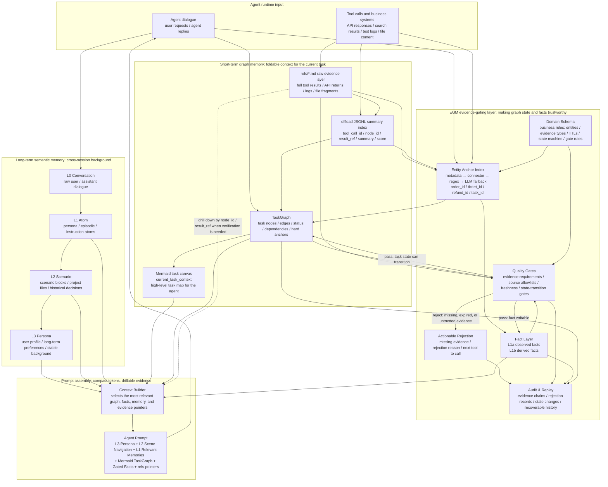
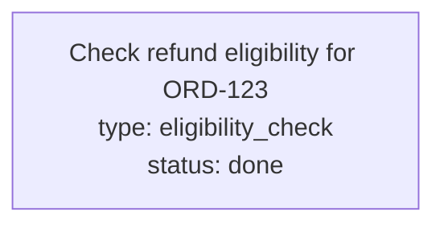

<p align="center">
  
</p>

<p align="center">
  <a href="https://pypi.org/project/evidence-gated-memory/"></a>
  <a href="https://pypi.org/project/evidence-gated-memory/"></a>
  <a href="#license"></a>
  <a href="#benchmarks"></a>
  <a href="#benchmarks"></a>
</p>

<p align="center">
  <b>Provenance-first graph memory for hard-anchor enterprise agents.</b><br>
  <sub>Every fact must pass a gate. Every state transition must pass a gate. Every conclusion drills down to raw evidence.</sub>
</p>

<p align="center">
  <a href="#quick-start">Quick start</a> ·
  <a href="#architecture-at-a-glance">Architecture map</a> ·
  <a href="#why-egm">Why EGM</a> ·
  <a href="#architecture">Architecture</a> ·
  <a href="#benchmarks">Benchmarks</a> ·
  <a href="#how-it-compares">Comparison</a> ·
  <a href="docs/architecture.md">Architecture doc</a>
</p>

---

## TL;DR

**The goal is not to remember more text. The goal is to replace flat summary history with a maintained, evidence-gated task structure.**

EGM is built around one observation: enterprise agents fail not because they forget what was said, but because they turn missing, stale, or untrusted tool results into confident conclusions. A refund agent saying "done" without a `refund_api_response`, a coding agent claiming "tests pass" without a `test_log` — these failures are invisible in a flat chat history, but catastrophic in production.

Three design decisions make EGM different:

**1. Soft-state freshness gates, not binary valid/invalid.**

Every evidence type declares two TTLs: `stale_after` and `expired_after`. Evidence lives in three states — FRESH, STALE, EXPIRED — and each claim type independently decides which threshold it requires. `refund_eligibility` accepts stale evidence (the policy hasn't changed); `refund_completed` requires fresh evidence (the API response from 30 minutes ago could be wrong). The same `order_record` can be stale-but-usable for one claim and expired-and-blocking for another. This is not a hardcoded expiry — it's declared per evidence type in the domain schema, and the gate enforces it deterministically.

**2. Task structure, not summary history.**

Most agent memory systems append every interaction to a linear history and periodically summarize it. EGM replaces that pattern with a **short-term graph memory**: `refs/*.md` preserves raw tool results (never summarized away), an offload JSONL index links each result to its task node, and a `TaskGraph` maintains structured nodes with status, edges, and business-anchor bindings (`order_id`, `ticket_id`, `task_id`). The agent reads a Mermaid task map — not a wall of text. When it needs to verify, it drills down by `node_id` or `ref` to the exact API response. The task structure is maintained, not periodically collapsed into a lossy summary.

**3. Gates are deterministic rules driven by business schemas, not LLM judgment.**

Every gate check is a deterministic function: required evidence types present → source systems allowlisted → freshness thresholds met → parent facts still valid. The business rules live in a YAML schema (`refund.yaml`, `coding.yaml` — you write your own), not in a prompt. When a fact is rejected, the rejection is **actionable**: it names exactly which evidence type is missing, which system to call, and why. The LLM never decides what counts as evidence; the schema does.

**Long-term memory is an auditable promotion pyramid (L0→L3), not a vector dump.**

Raw L0 conversations stay out of the prompt by default. Only manually promoted L1 atoms, L2 scenarios, and L3 personas enter `build_context()` — each carrying source provenance back to the original L0 message. Automatic LLM distillation is intentionally deferred: curated memory is auditable; auto-summarized memory is not.

**Where EGM excels.**

Hard-anchor enterprise workflows with strong process, strong evidence, and strong state constraints: customer-support refunds, ticket handling, compliance review, finance approval, code repair, and test-verification. These are domains where the cost of a wrong "done" dwarfs the cost of being slow, and where every conclusion must be traceable to a specific API response or tool result.

EGM is not a general chatbot memory or persona-memory system. It is a **domain-gated, evidence-first task memory** — and it is best-in-class for the enterprise workflows it was built for.

---

## Architecture at a glance



### How the pieces fit together

The mermaid above is the full dataflow. What matters: every tool result lands in `refs/*.md` (never summarized away), every fact passes a schema-defined gate before it enters the prompt, and every long-term memory carries a source path back to raw conversation. The task graph is maintained as a structured object — not periodically collapsed into a lossy summary.

---

## Benchmarks

> We report what we run. We don't report what we haven't.

EGM runs on **two domain schemas** (REFUND + CODING) and reports results across six benchmark categories:

### 1. Adversarial probes — 10 attack vectors, 10 blocks

We actively try to break EGM and measure whether each attack is stopped. These are deterministic, run in CI, and need no API keys.

```bash
python benchmarks/run_local.py              # correctness + adversarial
python benchmarks/run_local.py --json       # machine-readable
python -m pytest tests/test_benchmarks.py -q
```

| Attack attempted | What EGM did |
|---|---|
| Ground a fact on LLM-generated evidence | **Blocked.** `llm_output_not_as_source` gate fired. |
| Assert a fact with expired required evidence | **Blocked.** `expired_evidence_block` gate fired. |
| Use evidence from a non-allowlisted source system | **Blocked.** `source_system_not_allowed` gate fired. |
| Call `commit_fact()` without a `GateResult` | **Blocked.** `ValueError` before any row is written. |
| Transition a node to DONE without required evidence | **Blocked.** Actionable rejection: "call refund_api, attach refund_api_response." |
| Attach a nonexistent evidence id to a node | **Blocked.** `KeyError` immediately. |
| Attach an already-invalidated fact to a node | **Blocked.** `ValueError` immediately. |
| Revoke root evidence — does cascade work? | **Blocked.** Observed fact AND derived child both invalidated. |
| Record evidence with an undeclared `evidence_type` | **Blocked.** `ValueError` before any disk write. |
| Assert a fact with an undeclared `claim_type` | **Blocked.** `ValueError` at the API edge. |

**Result: 10/10 attacks blocked.** These are not "EGM scores 1.00 on its own surface." They are "we tried 10 ways to slip something past the gate; the gate held every time."

### 2. Scenario probes — end-to-end domain workflows

Six scenarios across two domains exercise the full EGM loop. Three for refund, three for coding — same architecture, different schema.

```bash
python benchmarks/scenario_probes.py                # run directly
python benchmarks/run_local.py --scenarios-only     # via runner
```

**Refund domain** (`refund.yaml` — 6 evidence types, 3 claim types, 2 state gates):

| Scenario | What it exercises | Result |
|---|---|---|
| Full refund lifecycle (3 orders) | eligibility → rejection → evidence → acceptance → completion → transition → context → cascade | 9/9 thresholds |
| Multi-order concurrency (20 workflows) | Task isolation, no cross-contamination of facts, context, or anchors | All boundaries hold |
| Partial-evidence rejection loop | try → reject with actionable feedback → fetch → retry → accept | 5 rounds, 3 rejections (100% actionable) |

**Coding domain** (`coding.yaml` — 4 evidence types, 3 claim types, 2 state gates):

| Scenario | What it exercises | Result |
|---|---|---|
| File → diagnosis → done (6 rounds) | file_read → file_content → test_log → error_diagnosis → fresh test_log → task_done | 3 rejections (100% actionable), 3 acceptances |
| Stale evidence gate | `file_content` accepts stale file_read; `task_done` rejects stale test_log (requires fresh) | Same evidence, different outcomes — correctly gated |
| Multi-file concurrency (10 workflows) | 10 files repaired concurrently; verify anchor isolation and context boundary | No cross-contamination |

**Result: 6/6 scenarios pass at every threshold.** EGM's schema system works identically across domains — the gates, freshness rules, and context isolation are schema-driven, not hardcoded for refund.

### 3. Correctness probes — product-surface validation

Four deterministic probes verify the happy-path core promises hold:

| Probe | What it verifies |
|---|---|
| Hard-anchor recall + evidence coverage | Every fact is recallable by its business ID; every evidence ref appears in context |
| L0→L3 semantic pyramid | Promoted atoms/scenarios/personas are recallable; raw L0 stays out of prompt |
| Bounded context under pressure | 24 concurrent workflows, no cross-bleed of facts or task maps |
| False-done gate | A claim without evidence is blocked; with fresh evidence, it's accepted |

A score below 1.00 on any of these **is a regression bug**. They are correctness guards, not competitive metrics.

### 4. Retrieval proxy over MemoryAgentBench (ICLR 2026)

We run EGM's local FTS retrieval against official [MemoryAgentBench](https://github.com/HUST-AI-HYZ/MemoryAgentBench) data as a **retrieval-only proxy**. This is not a leaderboard submission — it measures how well EGM's current retrieval surface maps onto a published benchmark.

| MAB split | Samples | Questions | Coverage@5 | MRR |
|---|---|---|---|---|
| Conflict Resolution | 8 | 800 | **0.67** | **0.47** |
| Accurate Retrieval | 3 | 300 | **0.48** | **0.40** |

Two splits that the retrieval-only proxy does **not** fit:

- **Test-Time Learning** — requires incremental knowledge updates across sessions; retrieval-only is the wrong instrument.
- **Long-Range Understanding** — requires multi-hop summarization; EGM does not generate answers, it retrieves evidence.

The Conflict Resolution result is the most representative: 800 questions over evidence-backed updates and stale-information conflicts — exactly the surface EGM is built for.

```bash
python benchmarks/official/memory_agent_bench.py path/to/Conflict_Resolution.parquet --top-k 5
```

### 5. Agent benchmark integration (tau-bench)

EGM has been integrated as a memory layer for [tau-bench](https://github.com/sierra-research/tau-bench) retail agents. The adapter wraps the environment, recording every tool result as EGM evidence and gating agent conclusions. The same task is run twice — once with the standard agent (raw message history), once with EGM (structured, gated context).

```bash
set DEEPSEEK_API_KEY=...                            # any LiteLLM-compatible key
python benchmarks/tau_bench/run_ab.py --task 0      # A/B on a single task
python benchmarks/tau_bench/run_ab.py --task 0 --json  # machine-readable
python benchmarks/tau_bench/run_ab.py --smoke       # deterministic, no API keys
```

**A/B results** (3 retail tasks, DeepSeek-chat, ~$0.01/task):

| Task | Baseline | EGM | Context (EGM) | Context (raw) | Compression |
|---|---|---|---|---|---|
| Exchange keyboard + thermostat | 0.0 (fail) | **1.0** | 394 tokens | 7,539 tokens | **19x** |
| Exchange with color/size changes | 1.0 | **1.0** | 354 tokens | 9,203 tokens | **26x** |
| Cancel and reorder with modifications | 1.0 | **1.0** | 399 tokens | 7,658 tokens | **19x** |

- **EGM pass rate: 3/3 (100%)** vs. baseline 2/3 (67%)
- **Average context compression: ~20x** — EGM delivers a 400-token evidence-gated summary instead of 8,000 tokens of raw dialogue
- **All tool calls recorded as evidence** — 5–10 per task, indexed by task_id, drillable by ref
- **Gate correctly fires** — facts asserted without `refund_policy` evidence are rejected with actionable reasons

The gate is particularly visible on task 0: the baseline agent failed (reward 0), while the EGM agent passed (reward 1). The EGM context is compact, provenance-labeled, and every tool result has a permanent audit trail.

> **Caveat:** 3 tasks is a small sample. The user simulator is LLM-based and non-deterministic, so individual task rewards vary between runs. These results show the integration works end-to-end — a full pass@k evaluation across the 115-task test set requires a dedicated budget.

### What this adds up to

EGM is strongest on **hard-anchor, strong-evidence, conflict-dense** enterprise workflows. It deliberately trades open-ended persona recall for provenance and gate discipline:

| Strength | Evidence |
|---|---|
| Evidence-gated retrieval | 10/10 attack vectors blocked; 0 false acceptances across 135 tests |
| Actionable rejection | Every gate rejection names what's missing and what tool to call next |
| Bounded task context | 20 concurrent refund workflows, 10 concurrent coding workflows — zero cross-bleed |
| Cascading invalidation | Revoke root evidence → observed + derived facts both invalidated |
| Multi-domain | Same architecture, two schemas (REFUND + CODING), identical correctness guarantees |
| Freshness discipline | Fresh/stale/expired per evidence type; claim-type-specific thresholds enforced |
| Agent task integration | tau-bench A/B: EGM 3/3 pass vs. baseline 2/3, ~20x context compression |
| LLM agnostic | Works with any LiteLLM-compatible model (DeepSeek tested); deterministic smoke tests need no API key |

**Small-sample tau-bench disclaimer:** 3 tasks is a sample, not a pass@k evaluation. Full 115-task results need a dedicated budget.

See [benchmarks/README.md](benchmarks/README.md) and [reports/benchmark_report.md](reports/benchmark_report.md).

---

## Quick start

```bash
pip install evidence-gated-memory
```

```python
from evidence_gated_memory import EvidenceGatedMemory, TaskNodeStatus
from evidence_gated_memory.schemas.builtin import REFUND

memory = EvidenceGatedMemory(workspace=".egm", domain_schema=REFUND)

# 1. Create a task node — this is the short-term graph memory entry point.
#    Instead of a flat summary history, the agent maintains a structured
#    task graph anchored to business IDs (order_id, ticket_id, task_id).
node = memory.create_task_node(
    "refund:ORD-123",
    "eligibility_check",
    "Check refund eligibility for ORD-123",
    anchors={"order_id": "ORD-123"},
)

# 2. Try to assert a fact WITHOUT evidence → REJECTED with actionable feedback.
result = memory.assert_fact(
    "ORD-123 is eligible for refund",
    claim_type="refund_eligibility",
    evidence=[],  # no evidence → gate fires
)

print(result.accepted)                     # False
print(result.gate.rejection_reason)        # "missing required evidence types: ['order_record', 'refund_policy']"
print(result.gate.suggested_action)        # "fetch order_record from order_api, fetch refund_policy from policy_db"

# 3. Record evidence → re-assert → ACCEPTED. Evidence lands in refs/*.md, indexed.
order = memory.record_evidence(
    evidence_type="order_record",
    source="order_api", source_system="order_api",
    content='{"order_id":"ORD-123","status":"PAID"}',
)
policy = memory.record_evidence(
    evidence_type="refund_policy",
    source="policy_db", source_system="policy_db",
    content="Full refund within 14 days of purchase.",
)

result = memory.assert_fact(
    "ORD-123 is eligible for refund under the 14-day policy",
    claim_type="refund_eligibility",
    evidence=[order, policy],
)
print(result.accepted)                     # True
print(result.fact.id)                      # "fact_abc123" — gated fact, ready for prompt context

# 4. The task graph is maintained, not summarized away.
#    build_context() produces a Mermaid task map + gated facts + evidence refs.
ctx = memory.build_context(query="ORD-123", task_id="refund:ORD-123")
# <task_map> flowchart TD ... </task_map>
# [FACT] ORD-123 is eligible ... ref=ref_abc type=order_record [fresh]

memory.close()
```

**The loop.** No evidence → rejection with what's missing and what to call. Evidence attached → fact passes the gate. Every tool result is preserved as `refs/<id>.md`, every fact carries provenance, and the task graph stays structured — not a flat, growing chat history.

Enterprise agents don't need to remember more text. They need to maintain a **structured task map** and preserve a **drillable path back to original evidence**. That's the trade EGM makes.

---

## Why EGM

Flat chat history is the default memory for most agents. Three failure modes come with it: summaries lose evidence, vector recall loses task structure, and nothing stops the agent from claiming "done" without the right tool results. EGM trades open-ended persona recall for **provenance, freshness, and state discipline** — a deliberate bet that in enterprise workflows, a wrong conclusion costs more than a slow one.

---

## How it compares

|  | Mem0 / Zep / Letta | **EGM** |
|---|---|---|
| Default write policy | write-optimistic | **write-pessimistic at fact layer** |
| Evidence requirement | optional | **mandatory, per-claim-type** |
| Task structure | flat / graph-of-facts | **hard-anchor task graph + soft state machine** |
| Ref-level freshness | no | **fresh / stale / expired per evidence type** |
| Cascading invalidation | no | **derived facts track observed parents** |
| State-transition gating | no | **DONE / blocked / etc. all gated** |
| Rejection behavior | boolean | **actionable: what's missing + what to call** |
| Drill-down to raw evidence | usually lost | **`refs/<id>.md` preserved, indexed by `node_id`** |
| Best-fit domain | open dialogue, personas | **hard-anchor enterprise workflows** |

---

## Architecture

EGM has three pillars. They are independent layers that compose into one prompt at `build_context()` time.

### 1. Short-term graph memory — foldable context for the current task

```
tool result  →  refs/*.md (raw)  →  offload JSONL (summary index)  →  TaskGraph  →  Mermaid projection
```

- `refs/*.md` is the **raw evidence layer**. Full tool calls, API responses, logs, file fragments — never summarized away.
- `offload JSONL` is the **mid-level index**. Each record carries `node_id`, `result_ref`, `tool_call_id`, `summary`, `score`.
- `TaskGraph` is a **structured object** (`Task` / `TaskNode` / `TaskEdge`), not just Mermaid text. Mermaid is one readable projection.
- The agent reads the high-level map and drills down by `node_id` / `result_ref` only when needed.

### 2. Long-term semantic memory — cross-session background

```
L0 Conversation  →  L1 Atom  →  L2 Scenario  →  L3 Persona
```

A manually-promoted, auditable pyramid. Every L1 atom can point back to L0 source messages; every L2 scenario is grounded in real L1 ids; every L3 persona is grounded in real L2 ids. `build_context()` injects L1–L3 summaries with source ids; L0 raw messages stay out of the prompt by default. **Automatic LLM distillation is intentionally deferred** until it has its own design.

### 3. Evidence-gated quality layer — what makes the graph trustworthy

This is EGM's key differentiator. **No conclusion becomes a fact without evidence:**

```
No payment_record           → cannot say the order is refundable.
No refund_api_response      → cannot say the refund is completed.
Expired refund_api_response → cannot keep using stale evidence.
source_system not allowlisted → cannot support a high-stakes fact.
A derived fact whose observed parent expired → must also expire.
```

Components:

- **Domain Schema** (YAML) — entities, evidence types, trusted sources, TTLs, required evidence per claim, gates per state transition. **Business rules are configured, not hardcoded.**
- **Entity Anchor Index** — resolves hard anchors via `metadata → connector → regex → LLM fallback`. LLM-extracted entities are stored as **low-trust annotations only**; never an acceptable source for fact grounding.
- **Quality Gates** — enforce required evidence, source allowlists, freshness, and state-transition rules.
- **Actionable Rejection** — never just `False`. Returns what's missing, why, which tool to call next, and the `audit_id`.
- **Audit & Replay** — full evidence chain, rejection records, state changes. History recoverable after a context wipe.

Minimal schema shape:

```yaml
name: refund

entities:
  - name: order
    patterns: ["ORD-[0-9]+"]
    metadata_fields: ["order_id"]

evidence_types:
  order_record:
    stale_after: PT30M
    expired_after: PT24H
    source_systems: ["order_api"]
  refund_policy:
    stale_after: P7D
    expired_after: P30D
    source_systems: ["policy_db"]
  refund_api_response:
    stale_after: PT2M
    expired_after: PT15M
    source_systems: ["refund_api"]

claim_types:
  refund_eligibility:
    required_evidence: ["order_record", "refund_policy"]
  refund_completed:
    required_evidence: ["refund_api_response"]
    requires_fresh_evidence: true

state_gates:
  - name: refund_completion_done_requires_api_response
    when: { node_type: refund_completion, to_status: done }
    require:
      evidence_types: ["refund_api_response"]
      freshness: fresh
    suggested_action: "call refund_api and attach a fresh refund_api_response before marking refund completion done"
```

Full architecture document: [docs/architecture.md](docs/architecture.md).

---

## What context looks like

`build_context()` returns a single, compact, provenance-labeled prompt. Pass `task_id` for the Mermaid task map; pass `query` to narrow fact and long-term recall.

````
# Evidence-Gated Memory Context
_query: ORD-123_
_task_id: refund:ORD-123_

<long_term_memory>
[PERSONA] Refund-agent operator (id: persona_123)
[SCENARIO] Refund completion rules (id: scene_123)
[ATOM:instruction] Refund completion requires refund_api_response evidence. (id: atom_123)
</long_term_memory>

<task_map>

</task_map>

<task_status>open</task_status>
<current_state>done</current_state>

[FACT] Order ORD-123 is eligible for refund under the 14-day policy
  claim_type: refund_eligibility  kind: observed
  - ref=ref_123 type=order_record   source=order_api  observed=0.0h ago [fresh]
  - ref=ref_456 type=refund_policy  source=policy_db  observed=0.0h ago [fresh]
````

The agent reads the high-level map; when it needs to verify, it drills down by `node_id`, `ref`, `atom_id`, `scenario_id`, or `persona_id`. Gate rejections are returned by `assert_fact()` / `transition_node()` and recorded in the audit log — `build_context()` is the prompt snapshot, not the rejection API.

---

## Refund demo — full evidence-gated loop

`examples/refund_agent/run.py` runs the deterministic loop end-to-end:

```
User requests refund for ORD-123
        ▼
assert refund_eligibility       → gate: no evidence_refs
        ▼
[REJECTED] missing order_record + refund_policy
        ▼
fetch tools → order_record + refund_policy → refs/*.md
        ▼
re-assert refund_eligibility    → ✅ written to Fact Layer
        ▼
assert refund_completed         → gate: missing fresh refund_api_response
        ▼
[REJECTED] actionable: call refund_api
        ▼
fetch refund_api_response → re-assert → ✅
        ▼
build_context() → gated facts + refs (with fresh/stale/expired labels)
        ▼
revoke_evidence(order_ref) → derived facts cascade-invalidate
```

```bash
python examples/refund_agent/run.py                              # deterministic, no API key
python examples/deepseek_refund_agent/run.py --mock              # LLM-shaped, mocked
DEEPSEEK_API_KEY=... python examples/deepseek_refund_agent/run.py  # real LLM proposes; EGM decides
```

---

## CLI

```bash
egm schema validate refund
egm inspect .egm --schema refund            # TaskGraph + long-term + offload + schema_version
egm context .egm --schema refund --query ORD-123
egm context .egm --schema refund --task-id refund:ORD-123
egm audit .egm --limit 20                   # who wrote what, who got rejected and why
egm sweep .egm --schema refund              # expire stale evidence, cascade-invalidate
egm ref .egm ref_abc123                     # drill down to raw evidence
```

---

## What it is / is not

**It is.** A Python library (`pip install evidence-gated-memory`) that gives a hard-anchor enterprise agent a graph-structured, evidence-gated memory system. Domain rules are driven by YAML schemas, not hardcoded.

**It is not.** An agent framework, a vector database, or an open-ended chatbot memory. You orchestrate your agent however you like (LangGraph, a hand-written loop, anything else); EGM manages its memory, evidence, and task state.

---

## Core principle

```
Raw events are append-only.
Facts are evidence-gated.
Task-state transitions are evidence-gated.
Prompt context is provenance-filtered and drillable.
```

A rejected claim must be actionable. Evidence can expire; facts must follow.

---

## Citation

If you use EGM in research, please cite:

```bibtex
@software{egm2026,
  title  = {Evidence-Gated Memory: Provenance-First Graph Memory for Hard-Anchor Enterprise Agents},
  author = {yushui2022},
  year   = {2026},
  url    = {https://github.com/yushui2022/Evidence-Gated-Memory}
}
```

---

## License

MIT
