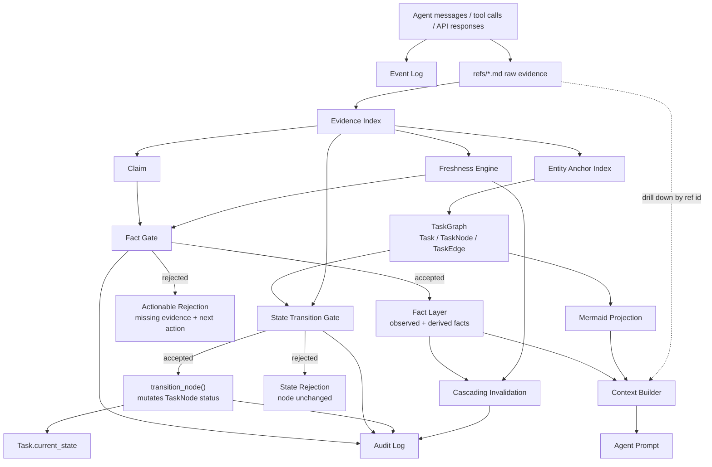

# Evidence-Gated Memory Architecture

Evidence-Gated Memory (EGM) is a graph-structured, evidence-gated memory
system for hard-anchor enterprise agents.

It is built for workflows where the agent works around stable business anchors
such as `order_id`, `ticket_id`, `refund_id`, `case_id`, or `task_id`, and where
an unsupported "done" is more dangerous than a slower answer.

EGM is not trying to be a general chatbot memory. It is a memory layer for
processes that need provenance, freshness, audit, and recoverable task state.

## Lineage

EGM borrows one core idea from TencentDB Agent Memory:

```text
Long linear history should become foldable, drillable, and recoverable context.
```

In that design family, the agent should not keep stuffing raw tool logs into
the prompt, and it should not rely on irreversible natural-language summaries.
Instead, high-level structure gives direction, mid-level indexes provide
handles, and low-level raw records remain available for drill-down.

EGM keeps that principle, but adds enterprise evidence discipline:

```text
TencentDB Agent Memory:
  foldable context + task maps + raw records

EGM:
  foldable task graph + raw evidence refs
  + evidence-gated facts
  + evidence freshness and cascading invalidation
  + gated task-state transitions
  + audit trail
```

The important difference is this:

```text
Traceability says: "I can find where this came from."
Evidence gating says: "This cannot become a fact, or a DONE state,
unless the required evidence is present, trusted, and fresh enough."
```

## What Is Implemented Now

The current repository implements the M1 short-term graph-memory pillar plus
the v0.1 evidence-gating core:

- append-only events and raw evidence refs
- claims, gate checks, committed facts
- evidence freshness and fact invalidation
- derived-fact cascading invalidation
- structured Task, TaskNode, and TaskEdge rows
- Mermaid task graph projection
- node backlinks from evidence and facts
- task-focused context building
- derived `Task.current_state`
- schema-driven task-state gates
- gated `transition_node()`
- audit log

The following are intentionally not implemented yet:

- M2: long-term semantic pyramid (`L0 Conversation -> L1 Atom -> L2 Scenario -> L3 Persona`)
- M3: offload JSONL index (`tool_call_id / node_id / result_ref / summary / score`)
- hosted server, UI, vector backend, graph database backend, or framework adapters

Those are future layers. M1 first makes the short-term task graph trustworthy.

## System Shape



## Pillar 1: Short-Term Task Graph Memory

The TaskGraph is the source of truth for the active workflow.

It is made of structured rows:

```text
Task:
  id
  title
  status
  current_state
  anchors

TaskNode:
  id
  task_id
  node_type
  title
  status
  anchors
  parent_id
  evidence_refs
  fact_refs
  blocked_reason
  suggested_action

TaskEdge:
  id
  task_id
  src_node_id
  dst_node_id
  kind
```

Mermaid is only a projection.

This is a load-bearing rule: the graph is not stored as Mermaid text. Mermaid is
a readable view over structured data. If Mermaid output is wrong, the TaskNode
and TaskEdge rows are still the authoritative memory.

TaskNode granularity is business-level, not message-level or tool-call-level.

Good nodes:

```text
check_order
check_payment
verify_refund
confirm_delivery
run_regression_tests
```

Bad nodes:

```text
user_message_17
tool_call_42
assistant_response_9
```

The business node is the level where `blocked`, `done`, and `skipped` have a
useful meaning.

## Pillar 2: Evidence-Gated Facts

Raw events and raw evidence are write-optimistic:

```text
record_event(...)
record_evidence(...)
```

Facts are write-pessimistic:

```text
assert_fact(...)
```

Internally, `assert_fact()` is:

```text
propose_claim -> check_gate -> commit_fact or reject
```

A claim becomes a Fact only if the gate accepts it.

The gate checks:

- claim type exists in the schema
- required evidence types are present
- evidence source systems are allowed
- LLM output is not used as source evidence
- required evidence is fresh enough
- derived facts depend on live parent facts
- schema-declared gates are satisfied

If the gate rejects, it returns a structured reason:

```text
missing evidence type
stale refs
expired refs
suggested action
```

This is the core product behavior. A rejection is not just `False`; it should
tell the agent what to fetch next.

## Pillar 3: Gated Task-State Transitions

Low-level status mutation still exists:

```python
memory.update_task_node_status(...)
```

That API is intentionally not gated. It is for tests, fixtures, manual recovery,
and repair scripts.

Production code should use:

```python
result = memory.transition_node(
    node.id,
    TaskNodeStatus.DONE,
    evidence=[refund_api_ref],
)
```

`transition_node()` does this:

```text
check_node_transition_gate
  -> if rejected: return TransitionResult(accepted=False), node unchanged
  -> if accepted: attach supplied evidence refs
  -> update node status
  -> refresh Task.current_state
  -> write audit
```

The schema decides which transitions require evidence:

```yaml
state_gates:
  - name: refund_completion_done_requires_api_response
    when: { node_type: refund_completion, to_status: done }
    require:
      evidence_types: ["refund_api_response"]
      freshness: fresh
    suggested_action: "call refund_api and attach a fresh refund_api_response before marking refund completion done"
```

That rule means the agent cannot mark a `refund_completion` node as `done`
unless fresh refund API evidence exists.

## Freshness and Cascading Invalidation

Evidence has time semantics.

Each evidence type can define:

```yaml
stale_after: PT5M
expired_after: PT1H
```

Freshness states:

```text
fresh:
  safe to use directly

stale:
  usable if the gate allows stale evidence, but prompt context must warn

expired:
  cannot support high-risk facts or state transitions

unknown:
  no TTL is declared
```

Facts can be observed or derived:

```text
observed fact:
  grounded directly in evidence refs

derived fact:
  grounded in other facts
```

When an evidence ref is revoked or expires, all facts depending on it are
invalidated. Derived facts cascade through their parent facts.

This prevents the dangerous state where the raw evidence is no longer valid,
but a conclusion derived from it still appears in the prompt as usable memory.

## Context Builder

`build_context()` creates prompt context from the memory system.

With a `task_id`, it emits:

````text
<task_map>
task_id: ...

</task_map>

<current_state>blocked</current_state>

[FACT] ...
  node: node_...
  - ref=ref_... type=... source=... freshness=...
````

The context builder does not dump raw evidence by default. It emits compact
facts, freshness labels, node links, and ref ids. If the agent needs the raw
source, it drills down with `read_ref(ref_id)`.

This is the foldable-context principle:

```text
Prompt gets the map.
Refs keep the raw evidence.
The agent can drill down when needed.
```

## Entity Extraction

Entity extraction is deliberately low-trust and provenance-labeled.

The current implementation uses:

```text
metadata fields -> regex patterns -> optional host-provided fallback
```

Business connectors should pass reliable ids through metadata:

```python
memory.record_evidence(
    evidence_type="order_record",
    source_system="order_api",
    content=payload,
    metadata={"order_id": "ORD-123"},
)
```

The optional fallback can be LLM-backed, but LLM-extracted entities are only
annotations for indexing and search. They are not acceptable as source evidence
for a fact or a state transition.

## Audit

The audit log records:

- gate checks
- fact commits
- fact invalidations
- task creation
- node creation
- node status changes
- state gate checks
- evidence/fact attachment to nodes
- task state changes
- edge creation

The audit log is append-only and currently unbounded. That is intentional for
the MVP because auditability is part of the value. A retention policy is a
future production hardening task.

## What Must Not Drift

These invariants come directly from the handoff and should not be weakened:

1. `update_task_node_status()` is low-level CRUD, not the gated API.
2. Production state changes go through `transition_node()`.
3. Attach calls validate their targets.
4. Phantom evidence refs and phantom fact refs are bugs.
5. Mermaid is a projection, not source of truth.
6. TaskNodes are explicit business nodes, not auto-derived messages.
7. Facts do not bypass gates.
8. Derived facts cascade when their support dies.
9. LLM-extracted entities are low-trust annotations, not evidence.

If a future change breaks one of these, it is not a harmless refactor. It changes
the product's trust model.

## Current Boundary

EGM is currently a Python library.

It is not:

- an agent framework
- a hosted service
- a vector database
- a general relationship-memory system
- a chatbot persona memory

It can be embedded under an agent orchestrator such as a hand-written loop,
LangGraph, or another workflow engine. The orchestrator decides what to do next;
EGM decides what memory, facts, evidence, and task-state transitions are
trustworthy enough to use.
